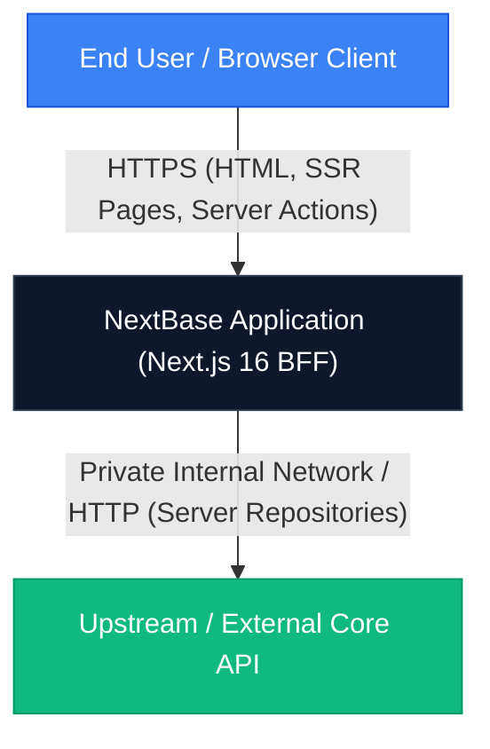
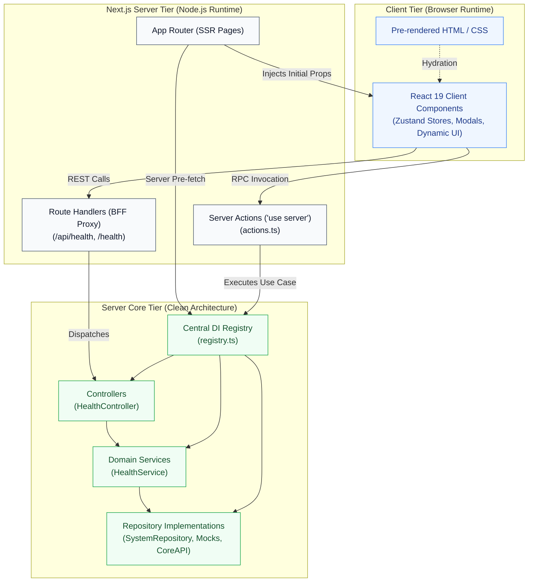
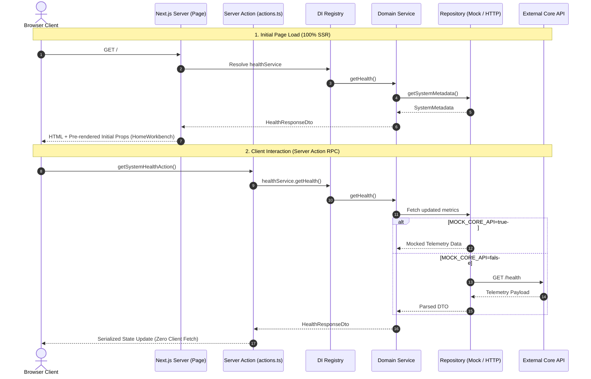

# System Design Document: NextBase (`code-base-nextjs`)

**Version**: 1.0.0  
**Status**: Production-Ready  
**Framework**: Next.js 16 (App Router) | React 19 | Tailwind CSS v4 | TypeScript 5 | Vitest  

---

## 1. Executive Summary & Core Objectives

**NextBase (`code-base-nextjs`)** is an enterprise-grade web application boilerplate built with strict separation of concerns, high modularity, and top-tier security standards. It combines **Clean Architecture** on the server layer with **Atomic Design** on the frontend UI layer, operating as a secure **Backend-For-Frontend (BFF)**.

### Primary Architectural Pillars
1. **100% Server-Side Rendering (SSR)**: Pages are pre-rendered on the server by default. No empty loading spinners on initial paint; search engine crawlable and performance optimized.
2. **Zero Direct Client-to-API Calls**: The client browser never communicates directly with external core APIs or databases. All communication is routed through Server Actions or Next.js Route Handlers, safeguarding private tokens and backend URLs.
3. **Decoupled Server Core (Clean Architecture)**: Domain services, repositories, controllers, and dependency injection are isolated into testable, swappable layers.
4. **Hierarchical Frontend (Atomic Design & Tokenization)**: A 4-level component library (Atoms, Molecules, Organisms, Templates) styled with centralized Tailwind CSS v4 design tokens, enabling complete white-labeling in seconds.
5. **Two-Stage Containerization**: Multi-stage Docker build strategy decoupling heavy `node_modules` installation from rapid source compilation.

---

## 2. High-Level Architecture & C4 System Diagrams

### 2.1 C4 Level 1: System Context Diagram

The browser client only interacts with the Next.js runtime. The Next.js application acts as a secure Backend-For-Frontend (BFF) boundary between client browsers and internal/external core services.



---

### 2.2 C4 Level 2: Container Diagram (Internal Runtime Tiers)



---

### 2.3 C4 Level 3: Component Diagram (Data Flow Architecture)



---

## 3. Communication Patterns & Security Perimeter

### 3.1 Zero Direct Client-to-API Calls
To prevent secret leaks, network exposure, and CORS overhead, client components never initiate HTTP requests directly to backend services:
- **Client Components** only invoke **Server Actions** (`'use server'`) or internal Next.js Route Handlers (`/api/*`).
- **Sensitive Environment Variables** (`CORE_API_URL`, backend secrets, private API keys) are omitted from the `NEXT_PUBLIC_` prefix, rendering them inaccessible to browser inspection.

### 3.2 Server-Side Rendering (SSR) by Default
NextBase operates as a foundational boilerplate. Domain pages are constructed as asynchronous React Server Components (RSC) to guarantee optimal SEO, fast Time-To-Interactive, and direct DI pre-fetching:
```tsx
// Example Reference Implementation: src/app/page.tsx
import { AppLayout } from '@/components/templates';
import { healthService } from '@/server/di';

export const dynamic = 'force-dynamic';
export const revalidate = 0;

export default async function HomePage() {
  const initialHealth = healthService.getHealth();
  return (
    <AppLayout>
      <div className="max-w-7xl mx-auto px-4 py-8">
        <h1 className="text-2xl font-bold">NextBase Dashboard</h1>
        <p className="text-slate-600">Uptime: {initialHealth.uptime}</p>
      </div>
    </AppLayout>
  );
}
```

### 3.3 Server Actions for Client Interactions
Client event handlers (button clicks, form submissions) dispatch type-safe asynchronous RPCs directly into Node.js runtime functions:
```ts
// src/app/actions.ts
'use server';

import { healthService } from '@/server/di';
import { HealthResponseDto } from '@/server/dtos/health.dto';

export async function getSystemHealthAction(): Promise<HealthResponseDto> {
  return healthService.getHealth();
}
```

---

## 4. Frontend Architecture: Atomic Design System

The UI layer is organized strictly according to **Brad Frost's Atomic Design methodology**, ensuring consistency, isolation, and modularity.

```
src/components/
├── atoms/        # Primitives: Button, Card, Badge, Modal, Input, Slider...
├── molecules/    # Combinations: StatCard, StatusPill, Callout, StepTracker...
├── organisms/    # Page Regions: Navbar, Sidebar, Topbar
└── templates/    # Layout Skeletons: AppLayout, DashboardLayout
```

### Component Catalog

| Level | Component | Key Capabilities |
|-------|-----------|------------------|
| **Atoms** | [`Badge`](../src/components/atoms/Badge/Badge.tsx) | 8 color variants (`primary`, `slate`, `blue`, `emerald`, etc.) |
| **Atoms** | [`Button`](../src/components/atoms/Button/Button.tsx) | `primary`, `secondary`, `outline`, `ghost`, `danger`, loading state |
| **Atoms** | [`Card`](../src/components/atoms/Card/Card.tsx) | Compound components: Header, Title, Description, Content, Footer |
| **Atoms** | [`Checkbox`](../src/components/atoms/Checkbox/Checkbox.tsx), [`Input`](../src/components/atoms/Input/Input.tsx), [`Select`](../src/components/atoms/Select/Select.tsx), [`Textarea`](../src/components/atoms/Textarea/Textarea.tsx) | Accessible form controls with label, helper, and error states |
| **Atoms** | [`Modal`](../src/components/atoms/Modal/Modal.tsx) | ESC handler, backdrop lock, header badge, scrollable body, footer actions |
| **Atoms** | [`FileUpload`](../src/components/atoms/FileUpload/FileUpload.tsx) | Drag-and-drop file upload with size & format validation |
| **Atoms** | [`ProgressBar`](../src/components/atoms/ProgressBar/ProgressBar.tsx), [`Slider`](../src/components/atoms/Slider/Slider.tsx) | Linear progress and range inputs wired to design tokens |
| **Atoms** | [`RadioCard`](../src/components/atoms/RadioCard/RadioCard.tsx), [`Tabs`](../src/components/atoms/Tabs/Tabs.tsx), [`Spinner`](../src/components/atoms/Spinner/Spinner.tsx), [`StatusDot`](../src/components/atoms/StatusDot/StatusDot.tsx) | Radio cards, tab switches, loaders, and status indicators |
| **Molecules** | [`Breadcrumb`](../src/components/molecules/Breadcrumb/Breadcrumb.tsx) | Hierarchical navigation trail with custom root and active crumb |
| **Molecules** | [`Callout`](../src/components/molecules/Callout/Callout.tsx) | Banner alerts (`info`, `warning`, `success`, `danger`) |
| **Molecules** | [`EmptyState`](../src/components/molecules/EmptyState/EmptyState.tsx) | Zero-data placeholder with graphic icon and action CTA |
| **Molecules** | [`SearchInput`](../src/components/molecules/SearchInput/SearchInput.tsx) | Search input with icon and focus ring |
| **Molecules** | [`StatCard`](../src/components/molecules/StatCard/StatCard.tsx) | Metrics card with trend indicators (`up`, `down`, `neutral`) |
| **Molecules** | [`StatusPill`](../src/components/molecules/StatusPill/StatusPill.tsx) | Telemetry status badge (`online`, `busy`, `warning`, `offline`) |
| **Molecules** | [`StepTracker`](../src/components/molecules/StepTracker/StepTracker.tsx) | Multistep wizard navigation indicator |
| **Molecules** | [`UserChip`](../src/components/molecules/UserChip/UserChip.tsx) | Avatar chip with initials, name, and role description |
| **Organisms** | [`Navbar`](../src/components/organisms/Navbar/Navbar.tsx) | Top application bar with responsive mobile menu toggle |
| **Organisms** | [`Sidebar`](../src/components/organisms/Sidebar/Sidebar.tsx) | Backoffice navigation bar with active route highlight and profile |
| **Organisms** | [`Topbar`](../src/components/organisms/Topbar/Topbar.tsx) | Admin header with breadcrumb navigation and action controls |
| **Templates** | [`AppLayout`](../src/components/templates/AppLayout/AppLayout.tsx) | Standard consumer app layout (`Navbar` + content + footer) |
| **Templates** | [`DashboardLayout`](../src/components/templates/DashboardLayout/DashboardLayout.tsx) | Admin layout (`Sidebar` + `Topbar` + scrollable viewport) |

---

## 5. Design Tokenization & Theme Customization (Tailwind CSS v4)

Tailwind CSS v4 is configured with **CSS-First Design Tokens** in [`src/app/globals.css`](../src/app/globals.css). Colors, surface layers, and border radii are mapped to CSS variables.

### Token Mapping Table

| CSS Token | Tailwind Class | Semantic Purpose |
|-----------|----------------|------------------|
| `--primary` | `bg-primary`, `text-primary`, `border-primary` | Primary brand color (buttons, active tabs, sliders) |
| `--primary-hover` | `hover:bg-primary-hover` | Interactive button and link hover states |
| `--primary-subtle` | `bg-primary-subtle` | Subtle highlights (badge backgrounds, active link pill) |
| `--primary-foreground` | `text-primary-foreground` | Readable text atop primary backgrounds |
| `--secondary` | `bg-secondary`, `text-secondary` | Secondary buttons and input container backgrounds |
| `--surface` | `bg-surface` | Card, modal, topbar, and drawer backgrounds |
| `--border` | `border-border` | Component outlines and dividers |
| `--muted` | `text-muted` | Subtitle and helper text |

### Theme Presets Out-of-the-Box
Themes can be activated dynamically via the `data-theme` attribute on the `<html>` root or container:

```html
<!-- Ocean Blue (Default) -->
<html>

<!-- Emerald Mint -->
<html data-theme="emerald">

<!-- Royal Violet -->
<html data-theme="violet">

<!-- Crimson Rose -->
<html data-theme="rose">

<!-- Amber Gold -->
<html data-theme="amber">

<!-- Slate Minimal -->
<html data-theme="slate">
```

---

## 5. Client State Management: Zustand v5

Client-side interactive state is maintained using **Zustand v5** under `src/stores/`.

### Design Invariants
1. **Explicit Interface Segregation**: Every store must explicitly define `<Name>State` and `<Name>Actions` interfaces.
2. **Redux DevTools Support**: Stores are wrapped with `devtools` middleware with descriptive action names.
3. **SSR Hydration Safety**: When persisting stores to `localStorage`, the `useHydratedStore` helper (built on React 19's `useSyncExternalStore`) prevents hydration mismatches without cascading `useEffect` renders.

```ts
// Example: src/stores/ui.store.ts
export interface UiState {
  isSidebarOpen: boolean;
  activeModal: string | null;
}

export interface UiActions {
  toggleSidebar: () => void;
  setSidebarOpen: (isOpen: boolean) => void;
  openModal: (modalId: string) => void;
  closeModal: () => void;
  resetUi: () => void;
}
```

### 5.2 Global Client Providers Architecture
For features requiring React Context (such as dark mode, accessibility tooltips, and floating toast notifications):
- **Server-First Boundary**: `src/app/layout.tsx` must always remain a **React Server Component (RSC)**. Do not convert `layout.tsx` into a client component.
- **Provider Wrapper**: Consolidate client context providers (`ThemeProvider` from `next-themes`, `TooltipProvider` from Radix UI, `<Toaster />` from Sonner) into a dedicated `'use client'` component (e.g. `AppProviders`), then mount it in `layout.tsx`.
- **Zero-Provider Zustand**: Unlike Redux or Context-based solutions, Zustand stores are external stores. They **do not require any provider component wrapper** to function. Any client component can subscribe directly to Zustand stores.

---

## 6. Server Core: Clean Architecture & DI Registry

All server-side code lives in `src/server/` and follows strict layered boundaries:

```
src/server/
├── dtos/          # Immutable, strongly typed API transfer contracts
├── repositories/  # Data access abstractions (ISystemRepository, SystemRepository)
├── services/      # Domain business logic (IHealthService, HealthService)
├── controllers/   # Request/response serialization (HealthController)
└── di/            # Central Dependency Injection container (registry.ts)
```

### Dependency Inversion Principle
1. **High-level modules** (Services) depend on **abstractions** (`ISystemRepository`), not concrete classes.
2. **Concrete repositories** implement interface contracts.
3. **DI Registry (`registry.ts`)** injects instances as singletons, controlled by the `MOCK_CORE_API` flag:

```ts
// src/server/di/registry.ts
export const systemRepository = new SystemRepository();
export const healthService = new HealthService(systemRepository);
export const healthController = new HealthController(healthService);

export const useMock =
  process.env.MOCK_CORE_API === 'true' ||
  process.env.NEXT_PUBLIC_MOCK_CORE_API === 'true' ||
  process.env.USE_MOCK_DATA === 'true';
```

---

## 7. Containerization & DevOps Strategy

Containerization utilizes a high-performance **Two-Stage Docker Build Strategy**:

```
[ package.json / package-lock.json ]
                 │
                 ▼
       deployment/Dockerfile.base
                 │
                 ▼
     code-base-nextjs-base:latest  (Cached node_modules)
                 │
                 ├──────────────────────────────┐
                 ▼                              ▼
        deployment/Dockerfile         deployment/build-app.sh
                 │
                 ▼
       code-base-nextjs:latest     (Production Standalone Runner)
```

### Deployment Automation Scripts (`deployment/`)

| Script | Purpose |
|--------|---------|
| [`build-base.sh`](../deployment/build-base.sh) | Builds dependency base image (`Dockerfile.base`). Rebuild only when dependencies change. |
| [`build-app.sh`](../deployment/build-app.sh) | Compiles Next.js standalone binary against pre-built base image in seconds. |
| [`build.sh`](../deployment/build.sh) | Smart runner: checks if base image exists; if not, builds base first then builds application. |
| [`build-multiarch.sh`](../deployment/build-multiarch.sh) | Multi-architecture builder (`linux/amd64`, `linux/arm64`) using `docker buildx`. |
| [`docker-compose.yaml`](../deployment/docker-compose.yaml) | Container orchestration with `.env` injection and `/api/health` healthchecks. |

---

## 8. Step-by-Step Guide: Adding a New Feature Module

To add a new domain feature (e.g. `UserManagement`):

### Step 1: Define DTO Contracts
Create `src/server/dtos/user.dto.ts`:
```ts
export interface UserDto {
  id: string;
  name: string;
  email: string;
  role: 'admin' | 'user';
}
```

### Step 2: Define Repository Contract
Create `src/server/repositories/user.repository.interface.ts`:
```ts
import { UserDto } from '../dtos/user.dto';

export interface IUserRepository {
  getUsers(): Promise<UserDto[]>;
  getUserById(id: string): Promise<UserDto | null>;
}
```

### Step 3: Implement Repositories (Mock & HTTP)
- Create `src/server/repositories/user.mock.repository.ts` (for local development & tests).
- Create `src/server/repositories/user.core-api.repository.ts` (for production core API integration).

### Step 4: Implement Domain Service
Create `src/server/services/user.service.ts`:
```ts
import { IUserRepository } from '../repositories/user.repository.interface';
import { UserDto } from '../dtos/user.dto';

export class UserService {
  constructor(private readonly userRepository: IUserRepository) {}

  async listUsers(): Promise<UserDto[]> {
    return this.userRepository.getUsers();
  }
}
```

### Step 5: Register in DI Container
Update `src/server/di/registry.ts`:
```ts
import { UserMockRepository } from '../repositories/user.mock.repository';
import { UserCoreApiRepository } from '../repositories/user.core-api.repository';
import { UserService } from '../services/user.service';

export const userRepository = useMock
  ? new UserMockRepository()
  : new UserCoreApiRepository();
export const userService = new UserService(userRepository);
```

### Step 6: Create Page & Server Actions
- Server Action in `src/app/users/actions.ts`:
  ```ts
  'use server';
  import { userService } from '@/server/di';
  export async function fetchUsersAction() {
    return userService.listUsers();
  }
  ```
- SSR Page in `src/app/users/page.tsx`:
  ```tsx
  import { userService } from '@/server/di';
  import { AppLayout } from '@/components/templates';

  export const dynamic = 'force-dynamic';

  export default async function UsersPage() {
    const users = await userService.listUsers();
    return (
      <AppLayout>
        {/* Render with Atoms/Molecules */}
      </AppLayout>
    );
  }
  ```

---

## 9. Quality Assurance & Testing Standards

- **Unit Testing Engine**: Vitest 5.0 with `@testing-library/react` and `jsdom`.
- **Target Coverage**: Strict minimum 80% coverage threshold on lines, functions, and branches.
- **Commands**:
  ```bash
  make test       # Runs 100% of unit tests
  make test-cov   # Generates V8 code coverage report
  make lint       # Executes ESLint 9 validation
  ```

---

## 10. Conclusion

NextBase provides a secure, maintainable, and high-performance foundation for building modern web applications. By enforcing **Clean Architecture** on the server and **Atomic Design** on the frontend with **100% Server-Side Rendering** and **Zero Direct Client-to-API Calls**, developers can build scalable products with confidence.
